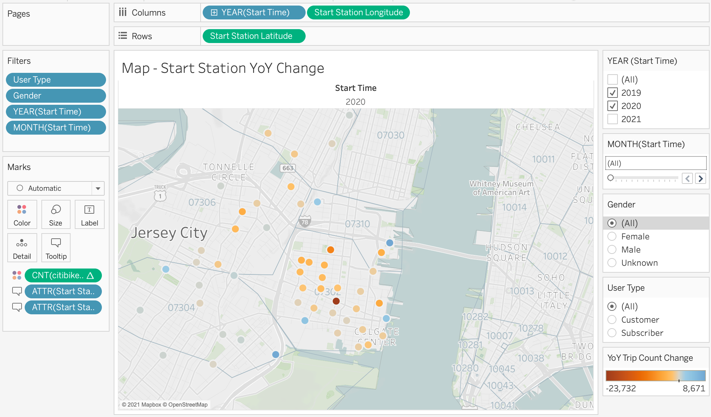

# NYC Citi Bike and the Trends Amid COVID-19 :bike:

***Hypothetical scenario:** NYC city officials would like to understand how Citi Bikes were utilized during the COVID-19 pandemic and if there's a lesson to be learned from the user behavior. Questions they might have in mind include but are not limited to: Were the bikes rented more often during the pandemic? What were the characteristics of the typical users? In which stations were the bikes rented the most? Were there insights to be gained relating all of these to the control of COVID-19 outbreak? And so on... From there, initiatives can be taken and programs can be implemented by the city planning and Citi Bike working hand in hand to promote safer use of the transportation while continue to provide the convenience to the public.*

### Objective
The main purpose of this project is to virualize Citi Bike usage and trends in New York City. My analysis is focused on the effect of COVID-19 pandemic from the perspective of user behaviors, customer type breakdown, and the change in popularities of bike stations.

A secondary objective is to practice using Tableau to generate meaningful vizs, create dashboards and tell a story. While I will only highlight the COVID analysis, there is also a second part of the analysis on some general user demographics, bike usage and top stations to start a journey in the complete workbook.

### Workbook
To access the Tableau workbook, download this repo or click [here](https://public.tableau.com/profile/tianchi.zhang#!/vizhome/NYCCitiBikeAnalysis-TripsDuringCOVID-19/CitiBikeUsageAmidCOVID-19) to view/download it directly from my Tableau public profile.

**Data source**: [Citi Bike NYC System Data](https://www.citibikenyc.com/system-data) --> [trip history data](https://s3.amazonaws.com/tripdata/index.html)

*Data was collected from the time period of 2019 to April 2021 (to the time of the making of this project). The rationale was to compare data from the year pre-pandemic, during pandemic, and semi-post-pandemic (debatable).*

## Here are the findings:

#### Analysis:
1. Looking at the line chart on the top left, overall the monthly bike trips in 2020 are lower than 2019. Though not much lower except the drastic dip in April (around the start of COVID-19 outbreak in the U.S.), it does show that people were being more mindful about going outdoor for bike rides. However, the dramatic increase from April to the end of the summer shows early signs of the continued COVID case increase in the area (trips mostly took place in Jersey City).
2. The line chart below that is plotted in similar fashion but with average trip duration (minutes) as the metric. Conversely, the monthly average trip durations were significantly higher in 2020. Let's take a deeper look at the user type month over month break down (right) to help explain this trend.
3. Looking at the color coded table on the right, the user type shares stayed consistent throughout 2019 except a small uptick in the short-term customers ("Customer" = 24-hour pass or 3-day pass user; "Subscriber" = Annual Member). An observable trend is that heading into the start of COVID-19 pandemic (March/April 2020 timeframe), the percentage of "Customer" jumped significantly. Theory to explain this phenomena:
   1. The continued increase of the short-term customers over 2020 shows that more non-subscribers started to use Citi Bike. This new group of customers was possibly riding Citi Bikes as a mean to relax and get a fresh air having been "forced" to stay at home for longer than usual. On the other hand, the seemingly more typical "on-and-off-work" type of rides declined since the objective of those was likely to get from point A to point B. Citi Bike probably did not collect data down to the details of occupations but I suspect the majority of the subscribers could be white collars, hourwives and so on. As outdoor activities were limited, companies transitioned to WFH, and people started to use more services like online deliveries, it is not surprising to see this trend. What's interesting is that heading into 2021 this trend seems to continue and even becomes more "sticky".
4. Finally, if we look at the year over year gender comparison, we can see that the vast majority of reported gender was Male in 2019 but "Unknown" in 2021.
   1. The shift to "Unknown" from 2019 to 2021 was largely impacted by an increasing short-term customers as shown earlier. If a user claims a bike with a 24-hour or 3-day pass, they might not have to report gender. As in the case of subscribers, they might have to or have the option to report gender when registering an account. This aligns with the overall trend we've been seeing so far -- a shifting user type thus a changing user behavior amid the pandemic.

#### Bonus

Additionally, if we look at how the trip count at each Start station changed from 2019 to 2020, we can see how COVID-19 affected where people chose to start their bike trips from and by how much. Blue dots indicate stations with more users starting their trips from in 2020, vice versa, orange dots indicate stations with fewer.

